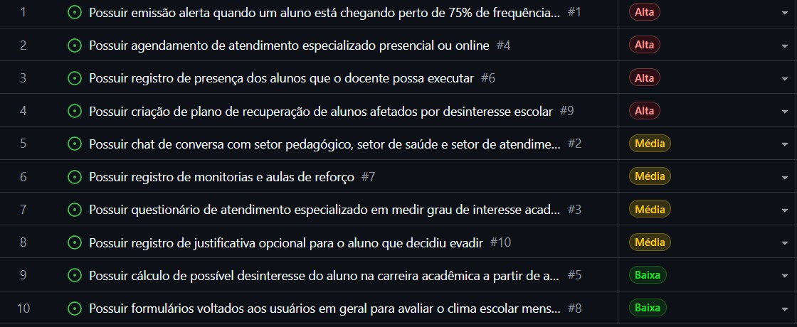

# Atividade Prática: Elicitação de Requisitos para o Sistema EduTech-Connect

PROCESSO DE SOFTWARE E ENGENHARIA DE REQUISITOS

Nicolas Saldanha Lersch e Alyssa Goulart Santos

 --- 

# **Sumário**
1. [Roteiro para a entrevista com os docentes](#roteiro-para-a-entrevista-com-os-docentes)
2. [Roteiro para o questionário com os discentes](#roteiro-para-o-questionário-com-os-discentes)
3. [Respostas do professor(a) entrevistado](#respostas-do-professor-entrevistado)
4. [Requisitos funcionais](#requisitos-funcionais)
5. [Requisitos não funcionais](#requisitos-não-funcionais)
6. [Backlog](#backlog)
7. [User Stories](#user-stories)
8. [Cenários BDD](#cenários-bdd)
9. [Autoavaliação INVEST](#autoavaliação-invest)

---

# **Roteiro para a entrevista com os docentes:**

**1. Qual sua possível percepção de desinteresse de seus alunos em seu referente curso e ambiente de estudo, você sente que isso pode atrapalhar diretamente o desempenho escolar e frequência deles?**

**2. Quais são os possíveis problemas notados dos estudantes além do ambiente escolar que possam impactar, diretamente ou indiretamente, sua frequência escolar e desempenho acadêmico em geral?**

**3. Você considera que o seu meio de ensino e conduta pode afetar diretamente o interesse geral pela disciplina respectiva aos seus estudantes? por que?**

**4. Você considera que executar adaptações de ensino de acordo com ambiente escolar de acordo com as necessidades da turma em uma disciplina específica ou no geral,  pode impactar diretamente o interesse dos alunos e seu desempenho escolar?**

**5. Você considera importante a correlação entre o docente e a instituição escolar para o bom rendimento escolar e interesse dos alunos? O que você consideraria uma ação entre docente e instituição que possa impactar positivamente o desempenho e interesse escolar dos alunos?**

**6. Você acredita que a relação entre seus alunos pode impactar positivamente ou negativamente seu desempenho e interesse escolar? De que formas você nota ou melhora a relação entre seus alunos?**


---

# **Roteiro para o questionário com os discentes:**

**1. Você se sente desconfortável a continuar a sua carreira acadêmica?**

Não / Provavelmente não / neutro / Provavelmente sim / Sim

**2. Você acha que o que causa seu desconforto está diretamente ligado ao ambiente escolar em que você está?**

Não / Provavelmente não / neutro / Provavelmente sim / Sim

**3. Você sente falta de ações em relação a qualidade de vida aos alunos  provenientes da instituição que são de grande auxílio em seu desempenho e interesse escolar?**

Não / Provavelmente não / neutro / Provavelmente sim / Sim

**4. Você possui problemas que derivam de sua vida fora da escola que possam impactar diretamente ou indiretamente seu desempenho e interesse escolar?**

Não / Provavelmente não / neutro / Provavelmente sim / Sim

**5. Cite alguns possíveis problemas em que possam afetar seu desinteresse em prosseguir em sua carreira acadêmica em sua instituição:**

**A) Problemas relacionados a professores (docentes)**

Não possuo / Possuo alguns  / Possuo vários

**B) Problemas relacionados a colegas (discentes)**

Não possuo / Possuo alguns  / Possuo vários

**C) Problemas relacionados a setores de auxílio ao estudante ( Assistência estudantil, biblioteca, setor de saúde, setor de cuidados especiais a alunos especiais ETC).**


Não possuo / Possuo alguns  / Possuo vários

**D) Problemas relacionados a auxílios permanência proporcionados pela instituição (Bolsa remunerada, auxílio transporte, auxílio moradia,  ETC)**

Não possuo / Possuo alguns  / Possuo vários

**E) Problemas relacionados à estrutura física de ambientes escolares ( salas de aula, luz e água, corredores, banheiros, ambientes para descanso e lazer, ETC)**

Não possuo / Possuo alguns  / Possuo vários

**F) Problemas relacionados à estrutura digital do campus (Sigga, Pergamum, Orbital, Portal  acadêmica iffarroupilha, ETC)**

Não possuo / Possuo alguns  / Possuo vários

**G) Problemas relacionados a carga de trabalho excessiva derivada do curso (Provas, trabalhos, projetos ETC)**

Não possuo / Possuo alguns  / Possuo vários

**H) Problemas relacionados à carga de trabalho fora da instituição (Emprego, Cursos secundários, Responsabilidades domiciliares)**

Não possuo / Possuo alguns  / Possuo vários


---

# **Respostas do professor entrevistado:**

1. Em minha percepção, o desinteresse dos estudantes pode estar relacionado a diferentes fatores, tanto internos quanto externos ao ambiente escolar. No contexto da Educação Profissional e Tecnológica, especialmente no Ensino Médio Integrado, percebo que muitos alunos apresentam dificuldades em compreender o sentido da formação integrada e a relação entre os conteúdos escolares e sua realidade concreta. Quando o estudante não consegue perceber significado no que aprende, isso tende a impactar diretamente sua motivação, frequência e desempenho acadêmico. Além disso, ambientes escolares excessivamente fragmentados, metodologias pouco participativas e currículos desarticulados podem ampliar esse distanciamento entre aluno e escola.

2. Entre os problemas observados além do ambiente escolar, destacam-se questões familiares, dificuldades financeiras, necessidade de trabalho, problemas emocionais e psicológicos, ansiedade, sobrecarga, conflitos familiares e uso excessivo de tecnologias e redes sociais. Também percebo que muitos estudantes enfrentam dificuldades relacionadas à saúde mental, baixa autoestima e insegurança em relação ao futuro profissional. Em alguns casos, há ainda situações de vulnerabilidade social que impactam diretamente a permanência e o rendimento escolar. Esses fatores interferem não apenas na frequência, mas também na concentração, participação e aprendizagem.

3. Sim. Considero que a metodologia de ensino, a postura docente e a forma como o professor constrói a relação pedagógica influenciam diretamente o interesse dos estudantes pela disciplina. Um ensino excessivamente mecânico, baseado apenas na transmissão de conteúdo, tende a afastar os alunos. Por outro lado, metodologias que promovem diálogo, participação, contextualização e integração entre teoria e prática geralmente despertam maior envolvimento. Acredito que o professor possui papel fundamental na mediação do conhecimento e na construção de um ambiente mais acolhedor, crítico e significativo para os estudantes.

4. Sim. Considero que adaptações pedagógicas realizadas de acordo com as necessidades da turma e do contexto escolar podem impactar positivamente tanto o interesse quanto o desempenho dos estudantes. Cada turma possui características próprias, diferentes ritmos de aprendizagem e distintas realidades sociais e culturais. Dessa forma, flexibilizar metodologias, utilizar recursos diversificados, propor atividades contextualizadas e considerar especificidades individuais contribui para tornar o processo de ensino mais inclusivo e significativo. Na minha prática docente, percebo que estratégias interdisciplinares, metodologias ativas e aproximações com situações reais aumentam o engajamento dos alunos.

5. Sim. A relação entre docente e instituição escolar é fundamental para o desenvolvimento de um ambiente educacional mais organizado, acolhedor e eficiente. Quando existe diálogo entre professores, coordenação, setores pedagógicos e gestão escolar, os estudantes tendem a receber um acompanhamento mais efetivo. Considero importantes ações como acompanhamento pedagógico contínuo, projetos interdisciplinares, fortalecimento da escuta dos estudantes, reuniões pedagógicas integradas e desenvolvimento de estratégias coletivas para permanência e êxito escolar. A instituição precisa compreender que o rendimento dos alunos não depende apenas do professor individualmente, mas de uma construção coletiva.

6. Sim. A relação entre os alunos pode influenciar tanto positiva quanto negativamente o desempenho e o interesse escolar. Ambientes marcados por respeito, cooperação e pertencimento tendem a favorecer a aprendizagem, enquanto conflitos, exclusão, bullying e competitividade excessiva podem gerar desmotivação e afastamento escolar. Procuro observar constantemente a dinâmica das turmas, incentivando atividades colaborativas, trabalhos em grupo, diálogo e respeito às diferenças. Também considero importante desenvolver práticas que fortaleçam a convivência, a empatia e o sentimento de participação coletiva dentro do ambiente escolar.


---

# **Requisitos funcionais**

**RF1** - Possuir emissão alerta quando um aluno está chegando perto de 75% de frequência e emitir alerta quando é alcançado 75% de frequência exata

**RF2** - Possuir chat de conversa com setor pedagógico, setor de saúde e setor de atendimento especial

**RF3** - Possuir questionário de atendimento especializado em medir grau de interesse acadêmico

**RF4** - Possuir agendamento de atendimento especializado presencial ou online

**RF5** - Possuir cálculo de possível desinteresse do aluno na carreira acadêmica a partir de análise de comportamento

**RF6** - Possuir registro de presença dos alunos que o docente possa executar

**RF7** - Possuir registro de monitorias e aulas de reforço

**RF8** - Possuir formulários voltados aos usuários em geral para avaliar o clima escolar mensalmente

**RF9** - Possuir criação de plano de recuperação de alunos afetados por desinteresse escolar

**RF10** - Possuir registro de justificativa opcional para o aluno que decidiu evadir

---


# **Requisitos não funcionais**

**RNF1 - Possuir integração com sites institucionais de acesso aberto**

Possibilita acesso facilitado a partir de outros sites institucionais, facilitando assim o acesso dos diversos alunos que frequentam estes sites, consequentemente aumentando o conhecimento da existência da ferramenta.

**RNF2 - Permitir acesso de docentes e técnicos da instituição para adaptação de setores**

Permitir adaptações de acordo com a existência de setores para mais ou para menos dependendo do local da instituição, podendo ser manipulado por professores e técnicos responsáveis.

**RNF3 - Permitir que apenas os profissionais do setor da saúde e pedagógico tenham acesso aos dados dos questionários que foram feitos pelos alunos**

Aumentar a segurança de dados dos alunos para tornar mais confortável a confissão de possíveis problemas relacionados ao curso ou a problemas da vida pessoas do aluno.

---

# **Backlog**


---

# **User stories**
**User Story #01: Alerta de Frequência do Discente (Abordando RF1)**
**CARD:** 
Como Discente, 
eu quero visualizar alertas sobre a proximidade do limite de faltas na minha página inicial,
 para que eu possa acompanhar minha frequência e evitar a reprovação por infrequência.

**CONVERSATION (Notas de Regra de Negócio):**
 - O aviso simples deve ser exibido quando a frequência do aluno estiver próxima do limite crítico (entre 75% e 80% de presença).
 - Caso o limite de 75% de frequência seja atingido ou ultrapassado, o alerta deve se tornar destacado e visualmente chamativo.

**CONFIRMATION (Critérios de Aceite):**
[ ] O sistema deve exibir um alerta visual simples na página inicial do discente quando a sua frequência registrada estiver próxima do limite crítico de 75%.
[ ] O sistema deve exibir um alerta destacado e de alta prioridade (ex: na cor vermelha) na página inicial do discente caso o limite mínimo de 75% de frequência seja alcançado ou ultrapassado.
[ ] O sistema deve atualizar o status e o percentual do alerta automaticamente a cada novo registro de presença ou ausência inserido no diário de classe.


**User Story #02: Agendamento de Atendimento Especializado (Abordando RF2)**
**CARD:**
Como Discente, 
eu quero agendar um atendimento especializado escolhendo entre o formato presencial ou online, 
para que eu receba o suporte necessário da forma que for mais conveniente para mim.

**CONVERSATION (Notas de Regra de Negócio):**
O sistema deve permitir a seleção explícita entre o formato de atendimento "Presencial" ou "Online".
Para agendamentos online, o sistema deve gerar automaticamente o link da videochamada; para agendamentos presenciais, deve exibir o número da sala física.

**CONFIRMATION (Critérios de Aceite):**
[ ] O sistema deve exibir um calendário dinâmico contendo os dias e horários disponíveis de cada profissional especializado para a escolha do discente.
[ ] O sistema deve exibir o local e o número da sala caso o discente selecione o atendimento presencial, ou gerar e disponibilizar o link da videochamada caso selecione o atendimento online.
[ ] O sistema deve permitir que o aluno visualize e cancele o agendamento diretamente pelo painel, respeitando o limite de antecedência parametrizado pela instituição.


**User Story #03: Registro de Presença Automatizado e Manual (Abordando RF3)**
**CARD:**
Como Docente, 
eu quero registrar a presença dos alunos de forma manual ou por meio de integração automática, para que o diário de classe esteja sempre atualizado com o menor esforço operacional possível.

**CONVERSATION (Notas de Regra de Negócio):**
 - O sistema deve oferecer uma interface para lançamento manual de faltas e presenças pelo professor.
 - O sistema deve possuir uma rotina automatizada para importar e migrar os dados de frequência a partir do sistema de ensino externo integrado.

**CONFIRMATION (Critérios de Aceite):**
[ ] O sistema deve exibir a listagem completa dos discentes matriculados na turma para que o docente possa realizar a chamada e o registro de presença de forma manual.
[ ] O sistema deve realizar a sincronização automática com o sistema de ensino externo parceiro para importar e consolidar os dados de presença sem a necessidade de intervenção humana.
[ ] O sistema deve exibir uma notificação de erro ou log de falha para o docente caso ocorra qualquer problema de comunicação ou sincronização entre as duas plataformas.


**User Story #04: Chat de Atendimento com Agendamento Integrado (Abordando RF4)**
**CARD:** 
Como Atendente de setores especializados, eu quero utilizar um chat de atendimento em tempo real focado em interações e marcações de encontros com os discentes, para que as dúvidas sejam sanadas e os agendamentos sejam feitos de forma ágil e centralizada.

**CONVERSATION (Notas de Regra de Negócio):**
 - A interface do chat deve integrar o acesso à agenda de compromissos diretamente na tela da conversa.
 - O atendente deve ser capaz de selecionar, confirmar e fechar o dia e o horário do encontro sem precisar sair ou navegar para fora do chat do discente.

**CONFIRMATION (Critérios de Aceite):**
[ ] O sistema deve disponibilizar uma interface de chat em tempo real que permita a comunicação direta e a troca de mensagens entre o atendente e o discente.
[ ] O sistema deve permitir que o atendente abra a agenda da instituição e realize a marcação de encontros (presenciais ou online) diretamente pela interface ativa do chat.
[ ] O sistema deve disparar notificações de confirmação com os detalhes do compromisso para as telas/e-mails do atendente e do discente logo após a finalização do agendamento.

**User Story #05: Cronograma Unificado de Monitorias e Atendimentos (Abordando RF5)**
**CARD:** 
Como Docente, 
eu quero cadastrar meus horários de monitoria e de atendimento ao aluno em uma única ação, 
para que eu organize minha rotina acadêmica de forma eficiente e clara para os estudantes.

**CONVERSATION (Notas de Regra de Negócio):**
 - Os horários criados de forma conjunta devem ser exibidos centralizados em um único cronograma geral.

 - O cronograma deve aplicar uma diferenciação visual clara e nítida entre o que é "Monitoria" e o que é "Atendimento" para evitar confusão visual por parte dos alunos.

**CONFIRMATION (Critérios de Aceite):**
[ ] O sistema deve disponibilizar um formulário unificado que possibilite o cadastro simultâneo de horários de monitoria e de atendimento ao aluno na mesma tela.
[ ] O sistema deve exibir um cronograma integrado para os alunos, utilizando cores ou tags visualmente distintas para diferenciar os horários de monitoria dos horários de atendimento.
[ ] O sistema deve permitir que o docente edite, exclua ou replique em lote esse conjunto de horários para semanas subsequentes do calendário acadêmico.

---

# **Cenários BDD**

**US01**

 ```gherkin
    Cenário 01: Caminho feliz
    Dado que um aluno possui frequência próxima do limite mínimo permitido
    E que o sistema monitora sua frequência regularmente
    Quando sua frequência atingir o limite configurado para alerta preventivo
    Então o sistema deve gerar uma notificação para a equipe pedagógica
    E registrar o alerta no histórico do aluno.
 
    Cenário 2: Fluxo Alternativo/Exceção
    Dado que um aluno alcançou exatamente 75% de frequência
    Quando os dados de frequência forem atualizados
    Então o sistema deve gerar um alerta crítico
    E notificar os responsáveis pelo acompanhamento acadêmico.
```
    
 
 **US02**

  ```gherkin
     Cenário 01: Caminho feliz
     Dado que o aluno está autenticado no sistema
     E que existe um horário disponível para atendimento
     Quando o aluno selecionar data, horário e modalidade de atendimento
     Então o sistema deve registrar o agendamento
     E enviar uma confirmação ao aluno.
 
     Cenário 2: Fluxo Alternativo/Exceção
     Dado que o aluno deseja agendar um atendimento
     Quando selecionar um horário já ocupado
     Então o sistema deve informar a indisponibilidade
     E apresentar horários alternativos.
  ```

**US04**

 ```gherkin
    Cenário 01: Caminho feliz
    Dado que o aluno está autenticado no sistema
    E que existe um horário disponível para atendimento
    Quando o aluno selecionar data, horário e modalidade de atendimento
    Então o sistema deve registrar o agendamento
    E enviar uma confirmação ao aluno.
 
    Cenário 2: Fluxo Alternativo/Exceção
    Dado que o aluno deseja agendar um atendimento
    Quando selecionar um horário já ocupado
    Então o sistema deve informar a indisponibilidade
    E apresentar horários alternativos.
  ```
---

# **Autoavaliação INVEST**

| Letra | Critério | US1 | US2 | US3 | US4 | US5 |
| --- | --- | --- | --- | --- | --- | --- |
| I | Independent | x | x | x | x | x |
| N | Negotiable |  x | x | x | x | x |
| V | Valuable |  x | x | x | x | x |
| E | Estimable | x | x |  |  |  x | x|
| S | Small | x |  |  |  | x | 
| T | Testable |  x | x | x | x | x |  
